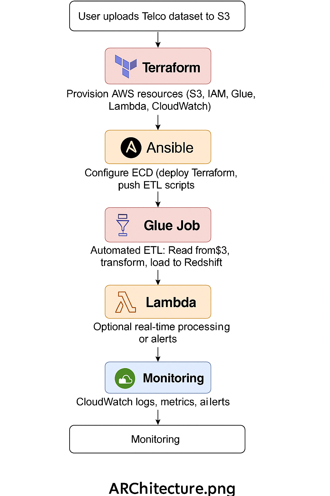
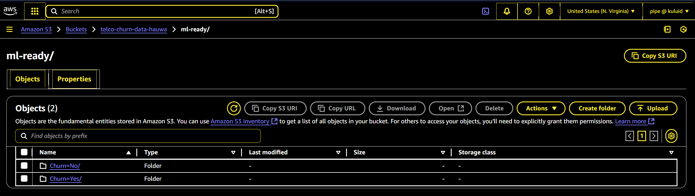

# 📉 Customer Churn Prediction & Retention Pipeline

## 📌 Project Overview

This project implements an **end-to-end customer churn prediction pipeline** for a telecom company using the IBM Telco Customer Churn dataset. It automates the entire lifecycle from raw data ingestion to ML-ready transformation, infrastructure-as-code, and CI/CD deployment.

### ✅ Key Features:
- Infrastructure provisioning with **Terraform**
- Configuration automation with **Ansible**
- ETL and data processing using **AWS Glue & PySpark**
- Data partitioning for ML consumption using **S3**
- CI/CD deployment with **GitHub Actions**
- Real-time monitoring via **CloudWatch**
- IAM-based access control
- ML script for churn prediction

---

## 🧬 Dataset Structure in S3

s3://telco-churn-data-hauwa/
├── raw/
│   └── WA_Fn-UseC_-Telco-Customer-Churn.csv
├── processed/
│   └── *.parquet
└── ml-ready/
    ├── Churn=Yes/
    └── Churn=No/
```

---

## ⚙️ Technologies Used

| Tool | Purpose |
|------|---------|
| **AWS S3** | Data storage (raw, processed, ML-ready) |
| **AWS Glue** | Serverless ETL using PySpark |
| **Terraform** | Infrastructure-as-Code |
| **Ansible** | Post-provisioning configuration |
| **GitHub Actions** | CI/CD pipeline for deployment |
| **CloudWatch** | Monitoring and logs |
| **IAM** | Secure access and role management |
| **PySpark** | Data transformation scripts |
| **Python** | ML script for churn prediction |

---

## 🔁 ETL Workflow

1. 📥 Upload raw dataset to `s3://telco-churn-data-hauwa/raw/`
2. ⚙️ Glue ETL Job:
   - Drops nulls & irrelevant columns
   - Converts CSV → Parquet format
   - Writes to `processed/` folder
3. 🔀 Second ETL:
   - Encodes churn column
   - Writes ML-ready data partitioned by `Churn=Yes/No` in `ml-ready/`

---

## 🧠 Machine Learning Script

> Located in: `scripts/churn_predictor.py`

The ML script takes the ML-ready output and performs:

- Label encoding
- Train-test split
- Training a classifier (e.g., Random Forest)
- Predicting churn probabilities
- Saving output as CSV or pushing to S3

---

## 📸 Architecture & Diagrams

### 🏗️ Architecture Diagram
> End-to-end pipeline architecture from ingestion to monitoring.

📷 `images/architecture.png`


---

### 🔄 ETL Flow Diagram

> Raw ➜ Processed ➜ ML-ready stages of the data pipeline.

📷 `docs/images/etl-flow.png`


---

### 📁 S3 Output Screenshot

> Screenshot showing partitioned ML-ready output on S3.

📷 `images/ml_image.png`


---

## 🚀 Deployment Guide

> Step-by-step to run the pipeline from scratch.

1. **Upload Dataset** to `s3://telco-churn-data-hauwa/raw/`
2. Run `terraform apply` to provision all AWS infrastructure.
3. Run `ansible-playbook configure.yml` (optional).
4. Push to GitHub to trigger **GitHub Actions** for deployment.
5. Monitor the **Glue Job** from AWS Console.
6. Validate S3 output in `ml-ready/Churn=Yes/` and `Churn=No/`
7. Run `churn_predictor.py` to apply ML predictions.

---

## 📩 Author
**Hauwa Kulu Njidda**
- 📧 hauwa.dbtech@gmail.com
- 🔗 [LinkedIn](https://www.linkedin.com/in/hauwa-kulu-njidda)

